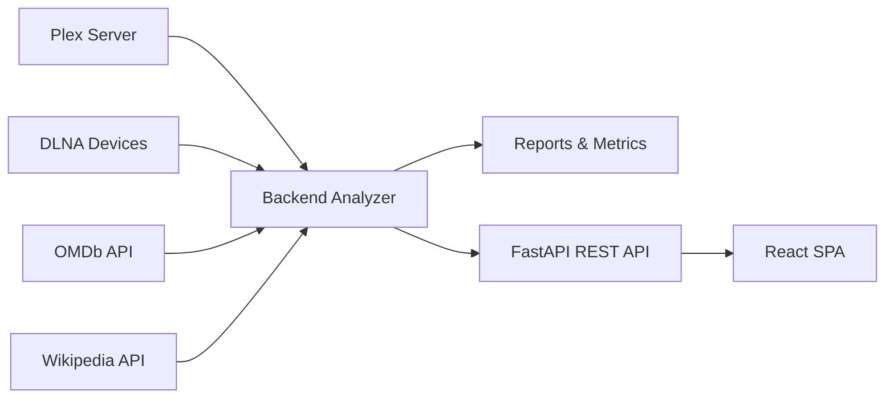

# 🎬 Analiza Movies

> **EN / ES – Bilingual Documentation**  
> Intelligent Media Library Analysis Platform

---

## 🇬🇧 Analiza Movies (English)

**Analiza Movies** is an advanced platform for analyzing, auditing, and optimizing multimedia libraries, designed for power users of **Plex**, **DLNA**, and external data sources such as **OMDb** and **Wikipedia**.

It combines **automated analysis**, **intelligent scoring**, **interactive dashboards**, and a **REST API** to help you make informed decisions about your collection: what to keep, improve, fix, or delete.

---

### 🚀 Value Proposition

- 📊 360° visibility of your media library  
- 🤖 Automated analysis with configurable scoring  
- 🧠 Metadata enrichment (OMDb + Wikipedia)  
- 🧹 Detection of duplicates, inconsistencies, and low-value content  
- 📈 Interactive dashboards and exportable reports  
- 🔌 REST API ready for integrations  
- 🛡️ Robust, modular, and scalable architecture  

---

### 💖 Support

If you find this project useful, you can support its development here:  
- GitHub Sponsors: https://github.com/sponsors/felixdelbarrio  
- PayPal: https://paypal.me/felixdelbarrio

---

## ⚡ Quickstart

1) Create environment files:
   - `cp .env.example .env`
2) Use Python `3.10+` and install dependencies: `make install`
3) Run the application: `make run`

### Production-like local run

1) Launch the native shell: `make run`
2) Close the native window to stop both UI and embedded backend

### Native desktop build

1) Install dependencies: `make install`
2) Generate the native bundle for your current OS: `make build`
3) Find the artifact in `dist-desktop/`

The desktop app embeds FastAPI + React in a native window and keeps external flows such as Plex login, IMDb and OMDb inside the application container instead of opening browser tabs.

---

## 🖥️ Interactive Frontend (React)

The frontend is now implemented from scratch in **React + TypeScript + Vite**.

It keeps the same analytical structure of the original dashboard, but moves to a component-based architecture that is significantly easier to evolve, optimize and brand at a higher visual level.

### Frontend Capabilities

- Cinematic navigation across dashboard, library, analytics, duplicates, metadata, cleanup and settings
- High-density exploration with virtualized tables and editorial detail panels
- ECharts-based visual storytelling with theme-aware rendering
- Profile-aware browsing across multiple Plex and DLNA origins
- React Query data loading on top of the FastAPI backend
- Safe delete execution through the API with dry-run support

### Development Model

- `make install` resets and provisions the full local environment
- `make run` launches the native desktop container with FastAPI embedded
- `make build` creates a native bundle for macOS, Linux or Windows
- `make ci` runs the local CI gate
- `make test` runs pytest only

### Repository layout

- `src/backend`: analysis engine, collectors, scoring and CLI orchestration
- `src/server`: FastAPI API, routers, middleware and services
- `src/desktop`: native desktop shell and packaging
- `src/shared`: runtime profiles and cross-application utilities
- `web/`: React frontend
- `docs/`: architecture and project documentation
- `tests/`: automated validation

---

## 🇪🇸 Analiza Movies (Español)

**Analiza Movies** es una plataforma avanzada de análisis, auditoría y optimización de bibliotecas multimedia, diseñada para usuarios exigentes de **Plex**, **DLNA** y fuentes externas como **OMDb** y **Wikipedia**.

Combina **análisis automático**, **scoring inteligente**, **dashboards interactivos** y una **API REST** para ayudarte a decidir qué conservar, mejorar, corregir o eliminar.

---

### 🚀 Propuesta de Valor

- 📊 Visión 360° de tu biblioteca  
- 🤖 Análisis automático con scoring configurable  
- 🧠 Enriquecimiento de metadatos (OMDb + Wikipedia)  
- 🧹 Detección de duplicados y contenido de bajo valor  
- 📈 Dashboards interactivos y reportes exportables  
- 🔌 API REST lista para integraciones  
- 🛡️ Arquitectura robusta, modular y escalable  

---

### 💖 Apóyame

Si este proyecto te resulta útil, puedes apoyarlo aquí:  
- GitHub Sponsors: https://github.com/sponsors/felixdelbarrio  
- PayPal: https://paypal.me/felixdelbarrio

---

## ⚡ Inicio rápido

1) Crea los archivos de entorno:
   - `cp .env.example .env`
2) Usa Python `3.10+` e instala dependencias: `make install`
3) Ejecuta la aplicación: `make run`

---

## 🖥️ Frontend Interactivo (React)

El frontend está ahora construido desde cero con **React + TypeScript + Vite**.

Mantiene la navegación, estructura analítica y riqueza visual del dashboard anterior, pero pasa a una arquitectura preparada para evolucionar con mucha más libertad en diseño, rendimiento y mantenibilidad.

### Funcionalidades del Frontend

- Navegación editorial entre dashboard, biblioteca, analítica, duplicados, metadata, limpieza y configuración
- Tablas virtualizadas para catálogos grandes
- Gráficos ECharts adaptados al tema visual activo
- Cambio global del origen visible entre múltiples perfiles Plex y DLNA
- Gestión de perfiles, descubrimiento en red y vinculación Plex desde la UI
- Acciones destructivas controladas vía API con soporte de simulación

### Ejecución

- `make install` reinicia y prepara todo el entorno local
- `make run` arranca la aplicación en contenedor nativo con FastAPI embebido
- `make build` genera la distribución nativa para tu sistema actual
- `make ci` ejecuta la pasarela local de calidad
- `make test` ejecuta solo pytest

### Estructura del repositorio

- `src/backend`: motor de análisis, scoring, clientes y CLI
- `src/server`: API FastAPI, routers, middleware y servicios
- `src/desktop`: shell nativo y empaquetado multiplataforma
- `src/shared`: perfiles de runtime y utilidades comunes
- `web/`: frontend React
- `docs/`: arquitectura y documentación de proyecto
- `tests/`: validación automatizada

### Distribuciones nativas

- La app de escritorio empaqueta FastAPI + React dentro de una ventana nativa.
- `dist-desktop/` contiene los artefactos locales generados con PyInstaller.
- GitHub Actions publica builds de Windows, Linux y macOS en cada ejecución del workflow de desktop.
- Si existen secretos de Apple Developer, la build de macOS firma y notariza; si no existen, la build sigue adelante sin bloquearse.

---

## 🧩 Main Components / Componentes Principales

- Backend Analyzer (CLI / batch)
- REST API Server (FastAPI)
- Interactive Frontend (React)
- Scoring & Decision Engine
- Caching & Resilience Layer
- Advanced Reporting

📐 **Architecture details / Detalle técnico:**  
➡️ [docs/ARCHITECTURE.md](docs/ARCHITECTURE.md)

## Typing support

This project is fully typed and compliant with **PEP 561**.
Type checkers such as **mypy** and **pyright** are fully supported.

---

## 🏗️ High-Level Architecture

